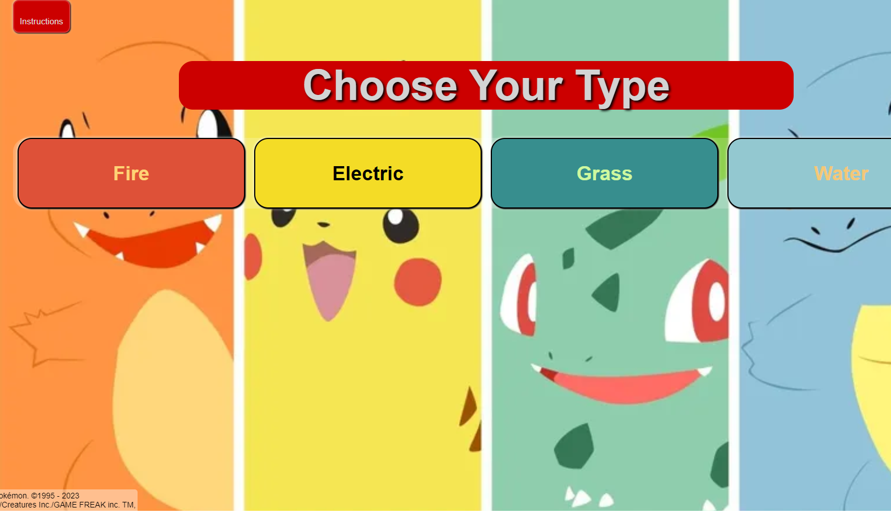
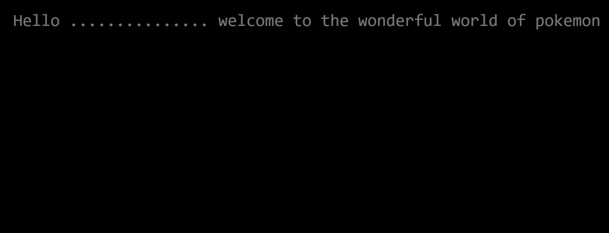
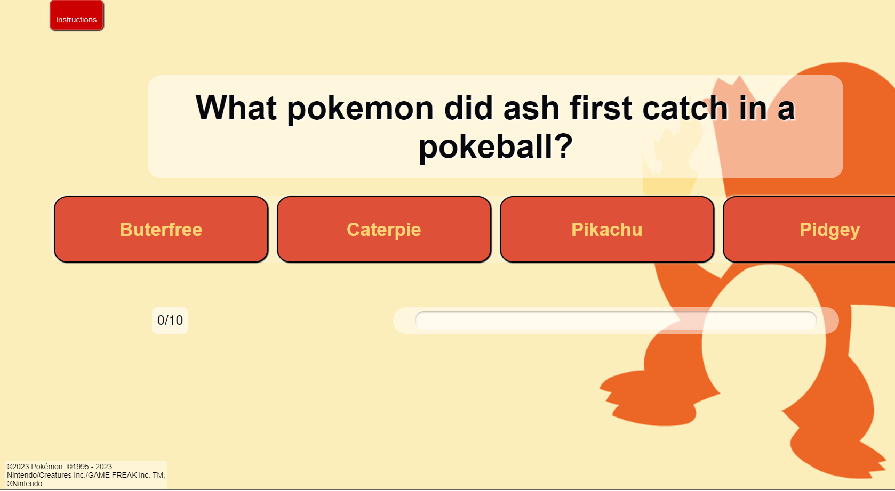
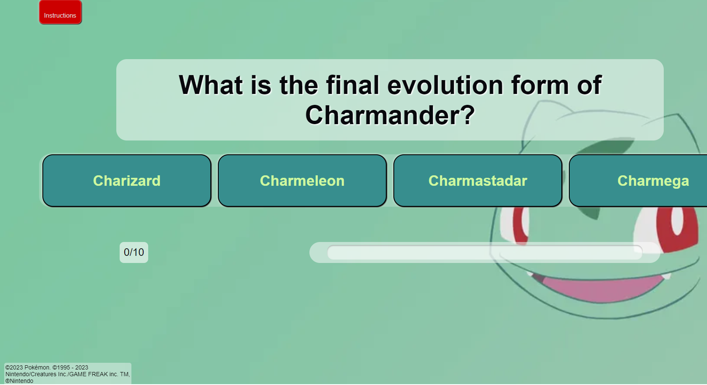
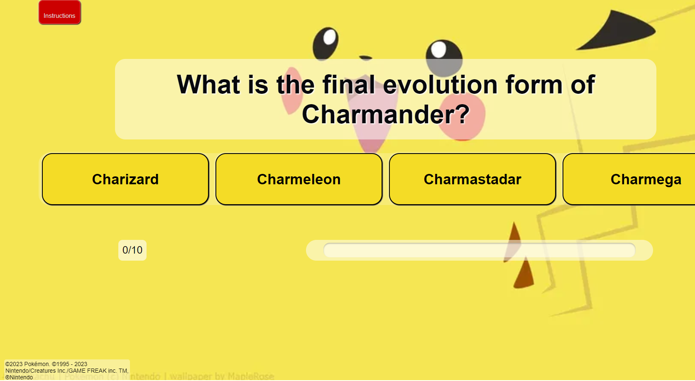
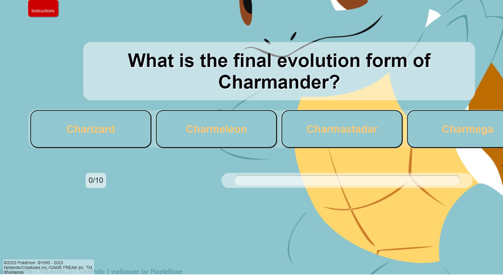

# Pokemon Quiz

This is a basic quiz that asks 10 questions of the user.

The idea was inspired by by the Project example idea 2; build an online quiz. to select the pokemon theme I took inspiration from my enjoyment of the pokemon games. 

The quiz is purely designed to test general/specific knowledge relating to the earlier games from pokemon generations 1 to two. With the goal of providing a challenging quiz to entertain online users.

The project was created using HTML and CSS and JavaScript. 

---
## Site Features

* **Navigation**

The page navigation is minimal. there is a welcome page as an intro, which leads into the main home page after animation. 
The home page is where the user is able to select a pokemon type which themes the quiz to their choice making the quiz more interactive. The home button uses javascript to refresh to this page.
There is an instruction page button which uses javascript to add a display; none class to relevant pages and reveals the instructions.
There is a quiz page once type is selcted where the main body of questions is asked and answered by the user.
The final page is a score page displaying what score the user got.

* **Welcome Page**
The opening welcome page is an homage to how most of the original pokemon games start with a black background and white text appearing and fading.
Animation in css was used to create this effect and relates the quiz from the beginnign to the chosen theme.

 

* **Home Page**
The home page is where the user can actiely engange and select the type they wish to set the quiz to. This will cusomize the quiz page to theme the page to their choice of type.
the four types chosen are taken from the original pokemon red, blue and yellow games of fire, grass, water and electric.

* **quiz Page**
The quiz page is where the questions are asked and the user can select answers. The quiz page background is changed depending on theme chosen.

* **Color Scheme**

---
* **Testing**
* This webpage has been tested, and works on different explorers such as Chrome, and FireFox.
* This project is responsive and has been designed to work on larger screens as well as small screens, using dev tools it has been tested on iphone screens, ipad screens, as well as other tablets. 
* All text is written and easy to understand

### Testing of Home page

### Testing of Timeline page

### Testing of Gallery Page

## Validator testing

*html
All code and pages have been checked through the W3C Markup Validation Service. The 1st error that came back was for a lack of opening p element in the index file, the checker expected to see an opening element after finding a closing element which was there btu it didnt see.
The 2nd error was an illegal character on the gallery page which was a space.

*css
All css code has been run through the W3C CSS Validation Service and has been passed with no errors found. 

* **Bugs**
All bugs for the webpage have been fixed. 

* **Bug Fixes**
* in the gallery page there were issues with the images placing directly nxt to each other, padding was introduced to seperate.
* the navigation menu when on smaller screens would have the "timetable" link would disapear off screen, text sizing and text spacing was reduced to allow this to be visisble.

---
## Launch and Deployment
* In the GitHub repository, navigate to the Settings tab.  
* Scroll down to the GitHub Pages section and click the 'Check it out here!' link.  

* The project has been created using gitpod and deployed using GitHub, the link for the live page is (https://ddrobrien.github.io/Millie-Cares/)

---

## Future Features

* This page can have a further video added to bottom of home page.
* A map of the site of the battle
* A list of museums for planning a visit to the battle site
---

## Credits

### Content
* The layout of the webpage came from inspiration of the CI [Love Running Project](https://ddrobrien.github.io/Love-Running/)
* Inspiration for both the gallery and sign up came from the CI [Love Running Project](https://ddrobrien.github.io/Love-Running/)
* The code for the navigation menu came from CI [Love Running Project](https://ddrobrien.github.io/Love-Running/)
* The font came from [google font](https://fonts.google.com/)
* Color palette inspiration came from [coolers.co](https://coolors.co/)
* html validation came from [W3C Markup Validation Service](https://validator.w3.org/#validate_by_input)
* css validation came from [W3C CSS Validation Service](https://jigsaw.w3.org/css-validator/)
icons inspiration came from [Love Runnning Project] but sourced from [Font Awesome](https://fontawesome.com/)
* The video was sourced from [History Uk](https://www.history.co.uk/)