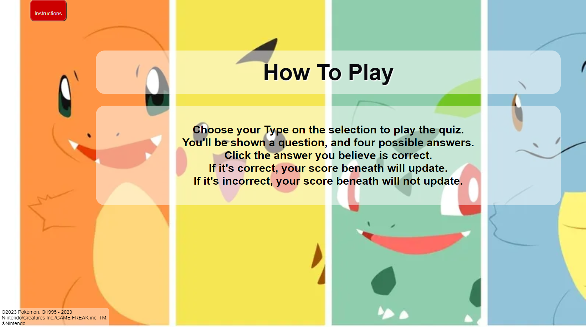

# Pokemon Quiz

This is a basic quiz that asks 10 questions of the user.

The idea was inspired by by the Project example idea 2; build an online quiz. to select the pokemon theme I took inspiration from my enjoyment of the pokemon games. 

The quiz is purely designed to test general/specific knowledge relating to the earlier games from pokemon generations 1 to two. With the goal of providing a challenging quiz to entertain online users.

The project was created using HTML and CSS and JavaScript. 

---
## Site Features

* **Navigation**

The page navigation is minimal. there is a welcome page as an intro, which leads into the main home page after animation. 
The home page is where the user is able to select a pokemon type which themes the quiz to their choice making the quiz more interactive. The home button uses javascript to refresh to this page.
There is an instruction page button which uses javascript to add a display; none class to relevant pages and reveals the instructions.
There is a quiz page once type is selcted where the main body of questions is asked and answered by the user.
The final page is a score page displaying what score the user got.

* **Welcome Page**
The opening welcome page is an homage to how most of the original pokemon games start with a black background and white text appearing and fading.
Animation in css was used to create this effect and relates the quiz from the beginnign to the chosen theme.

 

* **Home Page**
The home page is where the user can actiely engange and select the type they wish to set the quiz to. This will cusomize the quiz page to theme the page to their choice of type.
the four types chosen are taken from the original pokemon red, blue and yellow games of fire, grass, water and electric.

* **Quiz Page**
The quiz page is where the questions are asked and the user can select answers. The quiz page background is changed depending on theme chosen.
The question order is also randomized thanks to a javascript function.

* **Score Page**
The score page is the last page the user will see and provides the users answer and a quote.

* **Instructions Page**
The instrucitons Page is an optional page that the user wmay not see but provides a guide to the user on how the quiz functions.

* **Color Scheme**
The colour pallete for this project was taken from a multitude of pokemon themes.
The Welcome page was black and white text which is easily readble and resmebles the look of early generation pokemon game intro's.
the Home Page features buttons and heading with white lettering and red background as used by the iconic pokeball colours.
The different type colour themes are from the colour palletes of the pokemon used in the background image. These are charmader, pikachu, bulbasaur and squirtle.
The questions and instructions page are black text one a white faded background. This was so the questions and instructions were readable with the transparency so that the background was still visible behind as the changing background is a function.

---
* **Testing**
* This webpage has been tested, and works on different explorers such as Chrome, and FireFox.
* This project is responsive and has been designed to work on larger screens as well as small screens, using dev tools it has been tested on iphone screens, ipad screens, as well as other tablets. 
* All text is written and easy to understand

### Testing
HTML
Below is a detail of the erro found in the html
Error: Stray end tag main.
From line 87, column 1; to line 87, column 7
This stray tag was removed.

CSS
No erros were found in the CSS

General

The script was throwing an error due to the show score page not correctly being identified as the wrong elementselectbyID was stated at start of the page. This was fixed show that score was showing correctly.

The quiz works as intended and the score displays correctly. it works on multiple devices. The correct answers increase the score count and correctly shows the allocated quote at the end depending on this count score.

---
## Launch and Deployment
* In the GitHub repository, navigate to the Settings tab.  
* Scroll down to the GitHub Pages section and click the 'Check it out here!' link.  

* The project has been created using gitpod and deployed using GitHub, the link for the live page is (https://mtrh93.github.io/pokemonquiz/)

---

## Future Features

* Currently the instructions page overwrites existing quiz progress. future update to make it not make the user estart by including function to save progress.
* Future update would be to change the nav buttons to resmeble pokeballs to more go into the theme
---

## Credits
* (https://css-tricks.com/html5-progress-element/) for the progress bar
* Background Images from MapleRose via shutterstock.
* Parts of Javascript and the HTML and CSS layout from (https://abibubble.github.io/milestone2-harry-potter-quiz/)

### Content
* The font came from [google font](https://fonts.google.com/)
* Color palette inspiration came from pokemon colour palletes (https://pokepalettes.com/)
* html validation came from [W3C Markup Validation Service](https://validator.w3.org/#validate_by_input)
* css validation came from [W3C CSS Validation Service](https://jigsaw.w3.org/css-validator/)